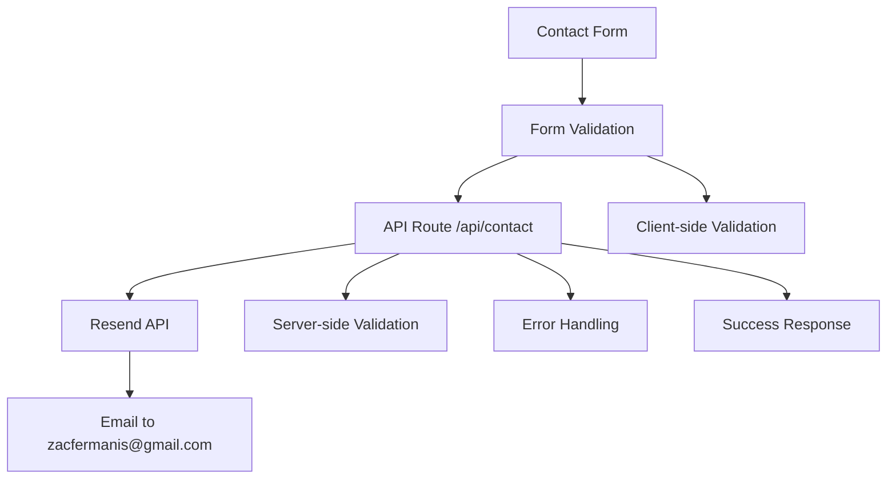
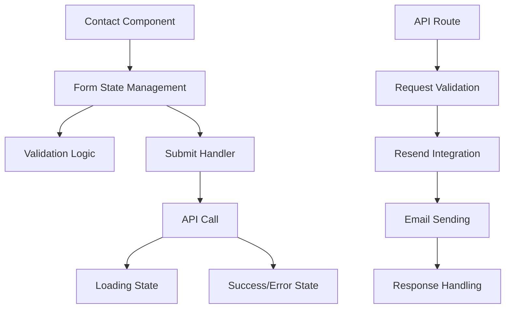

# Contact Form Submission Design

## Overview

The contact form submission feature will integrate Resend email service to send contact form submissions to zacfermanis@gmail.com. The implementation will include a Next.js API route for server-side email sending, enhanced form validation, and proper error handling.

## Architecture

### System Architecture


### Component Architecture


## Components

### 1. Enhanced Contact Component
**File**: `src/components/sections/Contact.tsx`

**Changes Required**:
- Replace mock submission with actual API call
- Add proper error handling for API failures
- Enhance validation with server-side feedback
- Add rate limiting protection

**Key Features**:
- Form state management with TypeScript
- Real-time validation feedback
- Loading states during submission
- Success/error message handling
- Form reset after successful submission

### 2. API Route
**File**: `src/app/api/contact/route.ts`

**Purpose**: Handle contact form submissions server-side

**Features**:
- Request validation and sanitization
- Resend API integration
- Rate limiting implementation
- Error handling and logging
- CORS configuration

### 3. Email Service
**File**: `src/utils/email.ts`

**Purpose**: Encapsulate Resend email functionality

**Features**:
- Email template formatting
- Resend API client configuration
- Error handling for email failures
- Environment variable management

## Data Models

### Form Data Interface
```typescript
interface ContactFormData {
  name: string
  email: string
  subject: string
  message: string
}
```

### API Request/Response
```typescript
interface ContactRequest {
  name: string
  email: string
  subject: string
  message: string
}

interface ContactResponse {
  success: boolean
  message: string
  error?: string
}
```

### Email Template
```typescript
interface EmailData {
  to: string
  subject: string
  html: string
  from: string
}
```

## Implementation Strategy

### Phase 1: API Route Setup
1. Create `/api/contact` route with Next.js App Router
2. Implement request validation middleware
3. Set up Resend client configuration
4. Add basic error handling

### Phase 2: Email Service Integration
1. Create email utility functions
2. Implement email template formatting
3. Add environment variable validation
4. Set up proper error handling

### Phase 3: Frontend Integration
1. Update Contact component to use real API
2. Enhance error handling and user feedback
3. Add rate limiting protection
4. Implement proper loading states

### Phase 4: Testing and Validation
1. Test API route functionality
2. Validate email delivery
3. Test error scenarios
4. Verify environment configuration

## Error Handling Strategy

### Client-Side Errors
- Form validation errors (immediate feedback)
- Network errors (retry mechanism)
- API errors (user-friendly messages)

### Server-Side Errors
- Invalid request data (400 Bad Request)
- Resend API failures (500 Internal Server Error)
- Rate limiting (429 Too Many Requests)
- Missing environment variables (500 Internal Server Error)

### Error Messages
```typescript
const ERROR_MESSAGES = {
  NETWORK_ERROR: 'Network error. Please check your connection and try again.',
  VALIDATION_ERROR: 'Please check your input and try again.',
  RATE_LIMIT: 'Too many requests. Please wait a moment before trying again.',
  SERVER_ERROR: 'Something went wrong. Please try again later.',
  EMAIL_FAILED: 'Failed to send email. Please try again or contact directly.'
}
```

## Security Considerations

### Input Validation
- Sanitize all user inputs
- Validate email format server-side
- Prevent XSS attacks through proper escaping
- Implement CSRF protection

### Rate Limiting
- Limit submissions per IP address
- Implement exponential backoff
- Log suspicious activity
- Prevent spam submissions

### Environment Security
- Secure API key storage
- Environment-specific configuration
- Proper error logging without exposing sensitive data

## Testing Strategy

### Unit Tests
- Form validation logic
- Email template formatting
- API route validation
- Error handling scenarios

### Integration Tests
- End-to-end form submission
- Email delivery verification
- Rate limiting functionality
- Environment configuration

### Manual Testing
- Form submission in development
- Email delivery to target address
- Error scenario testing
- Cross-browser compatibility

## Performance Considerations

### Optimization
- Minimal bundle size for email service
- Efficient form validation
- Quick API response times
- Proper loading state management

### Monitoring
- Email delivery success rates
- API response times
- Error frequency tracking
- User experience metrics

## Deployment Considerations

### Environment Variables
```bash
# Development (.env.local)
RESEND_API_KEY=your_resend_api_key_here

# Production (Vercel)
RESEND_API_KEY=your_production_resend_api_key_here
```

### Build Configuration
- Ensure API routes are properly built
- Validate environment variables at build time
- Configure CORS for production domain
- Set up proper logging

## Dependencies

### New Dependencies
```json
{
  "resend": "^2.0.0"
}
```

### Development Dependencies
```json
{
  "@types/node": "^20.0.0"
}
```

## Success Metrics

### Functional Metrics
- Email delivery success rate > 95%
- Form submission success rate > 98%
- API response time < 2 seconds
- Zero security vulnerabilities

### User Experience Metrics
- Form validation feedback < 100ms
- Loading state duration < 3 seconds
- Error message clarity score > 90%
- User satisfaction with contact process 