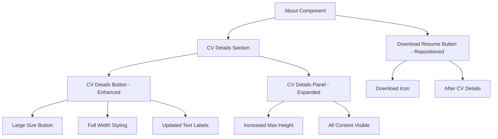

# CV Details Enhancement Design

## Overview
Design specification for enhancing the CV Details section with improved button design, expanded content area, and better user flow positioning.

## Architecture

### Component Updates
The enhancement involves updates to existing components without creating new ones:

```typescript
// CVDetailsButton component updates
interface CVDetailsButtonProps {
  isExpanded: boolean
  onToggle: () => void
}

// Updated styling and behavior
- size: "medium" → "large"
- className: add "w-full" for full width
- text: "View CV Details" → "View Full Resume"
- gap: "gap-2" → "gap-3" for better spacing
```

### Panel Height Enhancement
```typescript
// CVDetailsPanel component updates
- maxHeight: "max-h-[6000px]" → "max-h-[8000px]"
- Maintain existing animation and transition properties
```

### Button Repositioning
```typescript
// About component layout changes
- Move Download Resume button after CV Details section
- Add download icon to button
- Increase spacing: "pt-4" → "pt-6"
```

## Components

### CVDetailsButton Enhancements
- **Size**: Changed from medium to large for better prominence
- **Width**: Added full-width styling with `w-full` class
- **Text**: Updated to "View Full Resume" / "Hide Full Resume"
- **Spacing**: Increased gap between text and icon
- **Accessibility**: Updated ARIA labels to match new text

### CVDetailsPanel Enhancements
- **Height**: Increased maximum height from 6000px to 8000px
- **Animation**: Maintained existing smooth transitions
- **Responsive**: Preserved responsive design behavior

### About Component Updates
- **Layout**: Repositioned Download Resume button after CV Details
- **Icon**: Added download icon to button
- **Spacing**: Increased top padding for better visual separation

## Data Flow



## Implementation Strategy

### Phase 1: Button Enhancement
1. Update CVDetailsButton component styling
2. Change button size from medium to large
3. Add full-width styling
4. Update button text labels
5. Increase spacing between text and icon

### Phase 2: Panel Expansion
1. Update CVDetailsPanel maximum height
2. Test content visibility with new height
3. Verify animations still work smoothly
4. Confirm responsive behavior maintained

### Phase 3: Button Repositioning
1. Move Download Resume button in About component
2. Add download icon to button
3. Update spacing between sections
4. Test user flow and accessibility

### Phase 4: Icon Integration
1. Add download icon to Icon component
2. Integrate icon into Download Resume button
3. Ensure proper icon sizing and spacing
4. Test icon display across browsers

## Error Handling

### Button Functionality
- Maintain existing click handlers and state management
- Preserve accessibility attributes and ARIA labels
- Ensure keyboard navigation continues to work
- Keep focus management intact

### Panel Behavior
- Maintain graceful fallback if content exceeds new height
- Preserve smooth animations even with large content
- Ensure responsive design works on all screen sizes
- Keep accessibility features functional

### Icon Display
- Provide fallback for icon loading issues
- Ensure icon displays correctly across browsers
- Maintain proper spacing if icon fails to load
- Preserve button functionality without icon

## Testing Strategy

### Unit Testing
- Test CVDetailsButton with new styling and text
- Verify CVDetailsPanel with increased height
- Test Download Resume button with icon
- Validate accessibility attributes

### Integration Testing
- Test complete CV details expansion flow
- Verify button repositioning doesn't break layout
- Test responsive design with new button sizes
- Confirm animations work smoothly

### Manual Testing
- Verify button prominence and usability
- Test content visibility with expanded panel
- Confirm logical user flow with repositioned button
- Test on different devices and screen sizes

## Performance Considerations

### Animation Performance
- Maintain hardware-accelerated CSS transforms
- Ensure smooth transitions with larger content
- Optimize re-renders with efficient state management
- Preserve responsive performance

### Icon Loading
- Use inline SVG for download icon (no additional requests)
- Ensure icon doesn't impact page load time
- Maintain fast button rendering
- Preserve existing performance characteristics

## Accessibility

### Button Accessibility
- Update ARIA labels to match new button text
- Maintain keyboard navigation support
- Preserve focus management
- Ensure screen reader compatibility

### Panel Accessibility
- Maintain existing accessibility features
- Ensure content is fully accessible when expanded
- Preserve keyboard navigation through content
- Keep ARIA attributes accurate

### Icon Accessibility
- Add appropriate ARIA labels for download icon
- Ensure icon is properly announced by screen readers
- Maintain keyboard accessibility
- Preserve existing accessibility standards

## Security

### No Security Implications
- This enhancement only involves UI improvements
- No user input or data processing changes
- No authentication or authorization modifications
- No data transmission alterations

## Deployment Considerations

### Simple UI Updates
- No database changes required
- No API modifications needed
- No configuration updates
- Standard deployment process applies

## Success Metrics

### Usability Metrics
- [ ] CV details button is more prominent and accessible
- [ ] All CV content is fully visible without truncation
- [ ] Download Resume button appears in logical position
- [ ] User flow is intuitive and smooth

### Functionality Metrics
- [ ] Button expansion/collapse works properly
- [ ] Panel animations are smooth and professional
- [ ] Download button includes appropriate icon
- [ ] All existing features continue to work

### Accessibility Metrics
- [ ] Keyboard navigation works correctly
- [ ] Screen reader compatibility maintained
- [ ] ARIA labels are accurate and helpful
- [ ] Focus management functions properly

### Performance Metrics
- [ ] No performance degradation from changes
- [ ] Animations remain smooth and responsive
- [ ] Page load time unaffected
- [ ] Responsive design performance maintained 