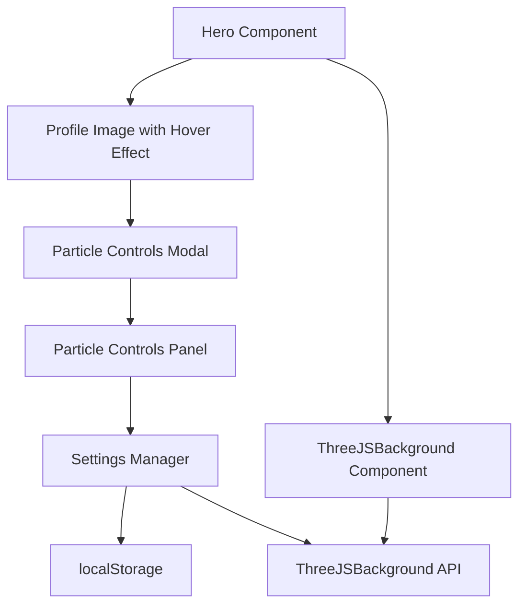
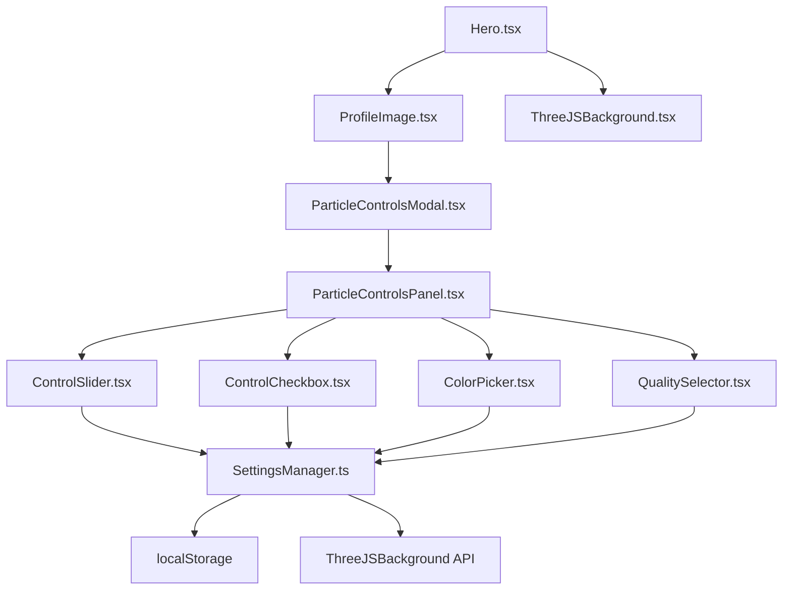

# Particle Background Controls Feature Design

## Overview

This design document outlines the architecture and implementation approach for the particle background controls feature. The feature will add interactive controls to the ThreeJS particle system in the Hero section, allowing users to customize the visual appearance and behavior of the background particles in real-time.

## Architecture

### High-Level Architecture



### Component Architecture



## Data Models

### Particle Settings Interface

```typescript
interface ParticleSettings {
  // Particle System Controls
  particleCount: number;        // 100-2000
  particleSpeed: number;        // 0.1-3.0 multiplier
  particleSize: number;         // 0.5-2.0 multiplier
  particleOpacity: number;      // 0.1-1.0
  
  // Visual Controls
  colorScheme: ColorScheme;     // 'blue' | 'purple' | 'green' | 'orange' | 'custom'
  customColor: string;          // RGB hex value
  
  // Performance Controls
  quality: 'low' | 'medium' | 'high';
  
  // Effect Controls
  rippleEffectEnabled: boolean;
  
  // UI State
  modalOpen: boolean;
}
```

### Color Scheme Configuration

```typescript
interface ColorSchemeConfig {
  name: string;
  primary: string;    // Main particle color
  secondary: string;  // Secondary particle color
  accent: string;     // Accent particle color
  background: string; // Background color
}

const COLOR_SCHEMES: Record<ColorScheme, ColorSchemeConfig> = {
  blue: {
    name: 'Blue',
    primary: '#1e40af',
    secondary: '#3b82f6', 
    accent: '#1e3a8a',
    background: 'transparent'
  },
  purple: {
    name: 'Purple',
    primary: '#7c3aed',
    secondary: '#a855f7',
    accent: '#581c87',
    background: 'transparent'
  },
  green: {
    name: 'Green',
    primary: '#059669',
    secondary: '#10b981',
    accent: '#047857',
    background: 'transparent'
  },
  orange: {
    name: 'Orange',
    primary: '#ea580c',
    secondary: '#f97316',
    accent: '#c2410c',
    background: 'transparent'
  },
  custom: {
    name: 'Custom',
    primary: '#1e40af',
    secondary: '#3b82f6',
    accent: '#1e3a8a',
    background: 'transparent'
  }
};
```

## Component Design

### 1. Enhanced Hero Component

**Purpose**: Integrate profile image hover effects and modal trigger

**Key Changes**:
- Add hover state management for profile image
- Add click handler to open particle controls modal
- Maintain existing functionality and styling

**Props**:
```typescript
interface HeroProps {
  name: string;
  title: string;
  description: string;
  ctaText: string;
  ctaLink: string;
  image?: string;
}
```

**State**:
```typescript
interface HeroState {
  isImageHovered: boolean;
  isModalOpen: boolean;
}
```

### 2. Particle Controls Modal

**Purpose**: Main modal container for particle controls

**Props**:
```typescript
interface ParticleControlsModalProps {
  isOpen: boolean;
  onClose: () => void;
  settings: ParticleSettings;
  onSettingsChange: (settings: Partial<ParticleSettings>) => void;
}
```

**Features**:
- Modal backdrop with blur effect
- Responsive design for mobile devices
- Keyboard navigation support (Escape to close)
- Click outside to close functionality
- Accessibility compliance with ARIA labels

### 3. Particle Controls Panel

**Purpose**: Main content area containing all particle controls

**Props**:
```typescript
interface ParticleControlsPanelProps {
  settings: ParticleSettings;
  onSettingsChange: (settings: Partial<ParticleSettings>) => void;
  onReset: () => void;
}
```

**Layout Structure**:
```
┌─────────────────────────────────────┐
│ Particle Background Controls        │
├─────────────────────────────────────┤
│ Information Section                 │
│ ┌─────────────────────────────────┐ │
│ │ ThreeJS particle system info    │ │
│ │ and description                 │ │
│ └─────────────────────────────────┘ │
├─────────────────────────────────────┤
│ Particle System Controls            │
│ ┌─────────────────────────────────┐ │
│ │ Particle Count: [====●====] 500 │ │
│ │ Particle Speed: [===●===] 1.0x  │ │
│ │ Particle Size:  [====●====] 1.0x│ │
│ │ Particle Opacity: [===●===] 0.4 │ │
│ └─────────────────────────────────┘ │
├─────────────────────────────────────┤
│ Visual Controls                     │
│ ┌─────────────────────────────────┐ │
│ │ Color Scheme: [Blue ▼]          │ │
│ │ Ripple Effect: ☑ Enabled        │ │
│ └─────────────────────────────────┘ │
├─────────────────────────────────────┤
│ Performance Controls                │
│ ┌─────────────────────────────────┐ │
│ │ Quality: [High ▼]               │ │
│ └─────────────────────────────────┘ │
├─────────────────────────────────────┤
│ Action Buttons                      │
│ ┌─────────────────────────────────┐ │
│ │ [Reset to Defaults] [Close]     │ │
│ └─────────────────────────────────┘ │
└─────────────────────────────────────┘
```

### 4. Control Components

#### ControlSlider Component

**Purpose**: Reusable slider component for numeric controls

**Props**:
```typescript
interface ControlSliderProps {
  label: string;
  value: number;
  min: number;
  max: number;
  step?: number;
  unit?: string;
  onChange: (value: number) => void;
  disabled?: boolean;
}
```

**Features**:
- Real-time value display
- Unit suffix support
- Accessibility with ARIA labels
- Touch-friendly on mobile devices

#### ControlCheckbox Component

**Purpose**: Reusable checkbox component for boolean controls

**Props**:
```typescript
interface ControlCheckboxProps {
  label: string;
  checked: boolean;
  onChange: (checked: boolean) => void;
  disabled?: boolean;
}
```

**Features**:
- Custom styled checkbox
- Keyboard navigation support
- Screen reader compatibility

#### ColorPicker Component

**Purpose**: Color scheme selection with custom color support

**Props**:
```typescript
interface ColorPickerProps {
  value: ColorScheme;
  customColor: string;
  onChange: (scheme: ColorScheme, customColor?: string) => void;
  disabled?: boolean;
}
```

**Features**:
- Dropdown for predefined color schemes
- Custom color input with color picker
- Live preview of selected colors

#### QualitySelector Component

**Purpose**: Performance quality level selection

**Props**:
```typescript
interface QualitySelectorProps {
  value: 'low' | 'medium' | 'high';
  onChange: (quality: 'low' | 'medium' | 'high') => void;
  disabled?: boolean;
}
```

**Features**:
- Dropdown with quality options
- Performance impact indicators
- Mobile-optimized selection

## Settings Management

### SettingsManager Class

**Purpose**: Centralized settings management with persistence

**Key Methods**:
```typescript
class SettingsManager {
  // Load settings from localStorage
  static loadSettings(): ParticleSettings;
  
  // Save settings to localStorage
  static saveSettings(settings: ParticleSettings): void;
  
  // Get default settings
  static getDefaultSettings(): ParticleSettings;
  
  // Reset to defaults
  static resetToDefaults(): ParticleSettings;
  
  // Validate settings
  static validateSettings(settings: Partial<ParticleSettings>): ParticleSettings;
}
```

**localStorage Structure**:
```json
{
  "particleSettings": {
    "particleCount": 1000,
    "particleSpeed": 1.0,
    "particleSize": 1.0,
    "particleOpacity": 0.4,
    "colorScheme": "blue",
    "customColor": "#1e40af",
    "quality": "high",
    "rippleEffectEnabled": true
  }
}
```

## ThreeJS Background Integration

### Enhanced ThreeJSBackground API

**New Props**:
```typescript
interface ThreeJSBackgroundProps {
  enabled?: boolean;
  quality?: 'low' | 'medium' | 'high';
  className?: string;
  // New props for dynamic control
  settings?: ParticleSettings;
  onSettingsChange?: (settings: Partial<ParticleSettings>) => void;
}
```

**Internal Methods**:
```typescript
class ThreeJSBackground {
  // Update particle count
  updateParticleCount(count: number): void;
  
  // Update particle speed
  updateParticleSpeed(speed: number): void;
  
  // Update particle size
  updateParticleSize(size: number): void;
  
  // Update particle opacity
  updateParticleOpacity(opacity: number): void;
  
  // Update color scheme
  updateColorScheme(scheme: ColorScheme, customColor?: string): void;
  
  // Toggle ripple effect
  setRippleEffectEnabled(enabled: boolean): void;
  
  // Update quality settings
  updateQuality(quality: 'low' | 'medium' | 'high'): void;
}
```

## Error Handling

### Error Scenarios

1. **localStorage Unavailable**
   - Graceful fallback to default settings
   - User notification about persistence limitations

2. **ThreeJS Context Loss**
   - Automatic reinitialization
   - Error recovery with fallback rendering

3. **Invalid Settings**
   - Validation and correction of out-of-range values
   - Fallback to safe defaults

4. **Performance Issues**
   - Automatic quality reduction
   - Frame rate monitoring and adjustment

### Error Recovery

```typescript
interface ErrorHandling {
  // Validate and correct settings
  validateSettings(settings: ParticleSettings): ParticleSettings;
  
  // Handle ThreeJS errors
  handleThreeJSError(error: Error): void;
  
  // Performance monitoring
  monitorPerformance(): void;
  
  // Graceful degradation
  enableFallbackMode(): void;
}
```

## Testing Strategy

### Unit Tests

1. **Component Tests**
   - ControlSlider component behavior
   - ControlCheckbox component behavior
   - ColorPicker component behavior
   - QualitySelector component behavior

2. **Settings Manager Tests**
   - localStorage operations
   - Settings validation
   - Default settings handling

3. **ThreeJS Integration Tests**
   - API method calls
   - Settings application
   - Error handling

### Integration Tests

1. **Modal Integration**
   - Modal open/close behavior
   - Settings persistence
   - Real-time updates

2. **Hero Component Integration**
   - Hover effects
   - Modal triggering
   - Background updates

### E2E Tests

1. **User Workflow**
   - Complete settings adjustment flow
   - Settings persistence across sessions
   - Mobile responsiveness

## Performance Considerations

### Optimization Strategies

1. **Debounced Updates**
   - Slider changes debounced to prevent excessive updates
   - Batch multiple setting changes

2. **Lazy Loading**
   - Modal content loaded only when opened
   - ThreeJS context preserved across modal sessions

3. **Memory Management**
   - Proper cleanup of ThreeJS resources
   - Event listener cleanup

4. **Rendering Optimization**
   - Use React.memo for control components
   - Optimize re-renders with useCallback/useMemo

### Performance Monitoring

```typescript
interface PerformanceMonitor {
  // Monitor frame rate
  monitorFrameRate(): number;
  
  // Monitor memory usage
  monitorMemoryUsage(): number;
  
  // Auto-adjust quality if needed
  autoAdjustQuality(): void;
  
  // Performance warnings
  showPerformanceWarning(): void;
}
```

## Accessibility Features

### WCAG 2.1 AA Compliance

1. **Keyboard Navigation**
   - Tab order through all controls
   - Escape key to close modal
   - Enter/Space for button activation

2. **Screen Reader Support**
   - Proper ARIA labels for all controls
   - Live regions for value changes
   - Descriptive labels for sliders

3. **Visual Accessibility**
   - High contrast mode support
   - Focus indicators
   - Color-blind friendly color schemes

4. **Motion Sensitivity**
   - Respect `prefers-reduced-motion`
   - Option to disable animations

## Mobile Responsiveness

### Responsive Design

1. **Modal Sizing**
   - Max width/height constraints
   - Scrollable content on small screens
   - Touch-friendly control sizes

2. **Touch Interactions**
   - Larger touch targets
   - Swipe gestures for sliders
   - Tap-to-close functionality

3. **Performance**
   - Reduced particle count on mobile
   - Optimized rendering for mobile GPUs
   - Battery usage considerations

## Security Considerations

1. **localStorage Security**
   - Validate all stored data
   - Sanitize user inputs
   - Prevent XSS through stored settings

2. **ThreeJS Security**
   - Validate color inputs
   - Sanitize numeric values
   - Prevent resource exhaustion

## Deployment Considerations

1. **Bundle Size**
   - Lazy load ThreeJS dependencies
   - Tree-shake unused features
   - Optimize control component imports

2. **Progressive Enhancement**
   - Feature detection for ThreeJS support
   - Fallback for unsupported browsers
   - Graceful degradation

3. **Monitoring**
   - Error tracking for ThreeJS issues
   - Performance monitoring
   - User interaction analytics 