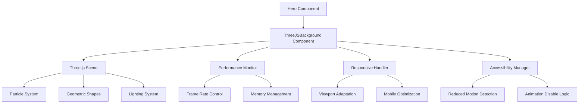
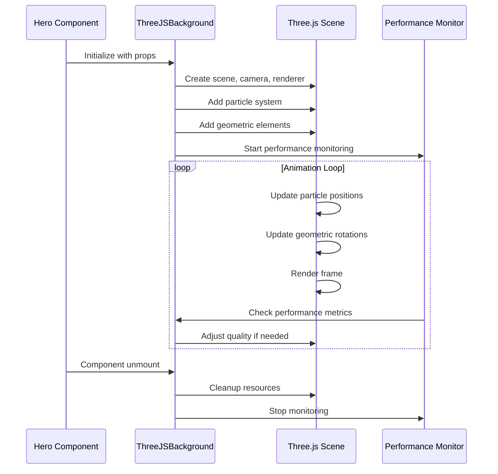

# Three.js Hero Background Animation - Design

## Overview

The Three.js hero background animation will create a sophisticated, professional visual experience that enhances the portfolio's modern appeal while maintaining excellent performance and accessibility. The animation will feature a dynamic particle system with flowing geometric elements that complement the existing blue/indigo gradient theme.

## Architecture

### Component Structure



### Data Flow



## Components

### 1. ThreeJSBackground Component

**Purpose**: Main container for Three.js animation
**Props**:
- `enabled`: boolean - Enable/disable animation
- `quality`: 'low' | 'medium' | 'high' - Performance quality setting
- `colorScheme`: object - Animation colors
- `particleCount`: number - Number of particles to render

**Key Features**:
- Automatic canvas sizing and responsive handling
- Performance monitoring and quality adjustment
- Accessibility compliance with reduced motion
- Memory cleanup on unmount

### 2. Particle System

**Purpose**: Create flowing, dynamic background elements
**Implementation**:
- **Geometry**: BufferGeometry with instanced rendering for performance
- **Material**: ShaderMaterial with custom vertex/fragment shaders
- **Animation**: GPU-accelerated position updates
- **Colors**: Blue/indigo gradient with subtle transparency

**Particle Behavior**:
- Gentle floating motion with slight randomness
- Size variation based on depth
- Opacity changes for depth perception
- Smooth transitions and easing

### 3. Geometric Elements

**Purpose**: Add structured, technical visual elements
**Types**:
- **Floating Cubes**: Subtle rotating geometric shapes
- **Connection Lines**: Thin lines connecting particles
- **Grid Patterns**: Background grid for depth

**Implementation**:
- Instanced meshes for performance
- Custom shaders for smooth animations
- Responsive scaling based on viewport

### 4. Performance Monitor

**Purpose**: Ensure smooth animation performance
**Features**:
- Frame rate monitoring
- Memory usage tracking
- Automatic quality adjustment
- Mobile device detection

**Quality Levels**:
- **High**: Full particle count, complex shaders
- **Medium**: Reduced particles, simplified effects
- **Low**: Minimal particles, basic animations

## Data Models

### Animation Configuration

```typescript
interface AnimationConfig {
  enabled: boolean;
  quality: 'low' | 'medium' | 'high';
  particleCount: number;
  colors: {
    primary: string;
    secondary: string;
    accent: string;
    background: string;
  };
  performance: {
    targetFPS: number;
    maxMemoryUsage: number;
    mobileOptimization: boolean;
  };
  accessibility: {
    respectReducedMotion: boolean;
    reducedMotionAlternative: 'static' | 'minimal' | 'disabled';
  };
}
```

### Performance Metrics

```typescript
interface PerformanceMetrics {
  fps: number;
  memoryUsage: number;
  renderTime: number;
  deviceType: 'desktop' | 'tablet' | 'mobile';
  qualityLevel: 'low' | 'medium' | 'high';
}
```

## Error Handling

### Three.js Context Loss
- **Detection**: Monitor WebGL context loss events
- **Recovery**: Attempt to restore context and reinitialize
- **Fallback**: Graceful degradation to static background

### Performance Degradation
- **Monitoring**: Continuous FPS and memory tracking
- **Adaptation**: Automatic quality level adjustment
- **User Feedback**: Optional performance indicator

### Browser Compatibility
- **WebGL Support**: Check for WebGL availability
- **Fallback**: CSS-based alternative animation
- **Graceful Degradation**: Static gradient background

## Testing Strategy

### Unit Tests
- Component initialization and cleanup
- Performance monitoring accuracy
- Accessibility compliance
- Responsive behavior

### Integration Tests
- Hero component integration
- Performance under load
- Cross-browser compatibility
- Mobile device testing

### Visual Regression Tests
- Animation appearance across devices
- Color scheme consistency
- Responsive scaling accuracy

## Implementation Plan

### Phase 1: Core Three.js Setup
1. Install Three.js dependencies
2. Create basic ThreeJSBackground component
3. Implement scene, camera, and renderer setup
4. Add basic particle system

### Phase 2: Animation Development
1. Implement particle movement algorithms
2. Add geometric elements
3. Create custom shaders
4. Implement color scheme integration

### Phase 3: Performance Optimization
1. Add performance monitoring
2. Implement quality adjustment
3. Optimize for mobile devices
4. Add memory management

### Phase 4: Accessibility & Polish
1. Implement reduced motion support
2. Add responsive design
3. Create fallback animations
4. Final testing and optimization

## Technical Considerations

### Shader Implementation
- **Vertex Shader**: Handle position updates and transformations
- **Fragment Shader**: Manage colors, transparency, and effects
- **Uniforms**: Pass time, colors, and configuration data
- **Attributes**: Particle positions, sizes, and velocities

### Memory Management
- **Dispose**: Proper cleanup of Three.js resources
- **Texture Management**: Efficient texture loading and disposal
- **Geometry Pooling**: Reuse geometry objects when possible
- **Garbage Collection**: Minimize object creation in animation loop

### Responsive Design
- **Viewport Detection**: Monitor screen size changes
- **Canvas Scaling**: Adjust canvas size and resolution
- **Performance Adaptation**: Adjust quality based on device capabilities
- **Touch Interaction**: Handle mobile touch events appropriately

## Dependencies

### Required Packages
```json
{
  "three": "^0.160.0",
  "@types/three": "^0.160.0"
}
```

### Optional Enhancements
```json
{
  "stats.js": "^0.17.0",
  "dat.gui": "^0.7.9"
}
```

## Performance Targets

- **Desktop**: 60fps with high quality settings
- **Tablet**: 45fps with medium quality settings  
- **Mobile**: 30fps with low quality settings
- **Memory Usage**: < 50MB for animation system
- **Load Time**: < 500ms for animation initialization 