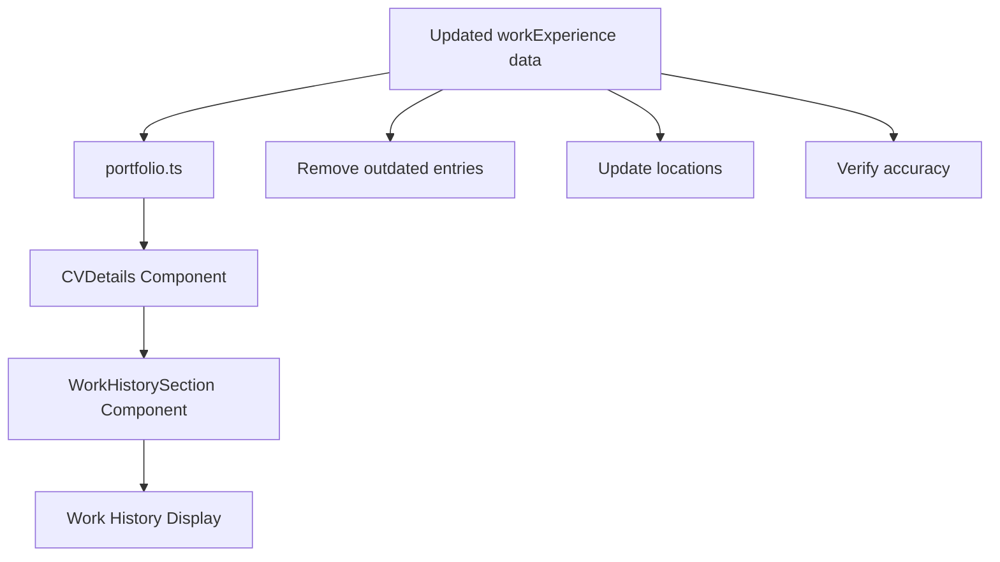

# Work History Update Design

## Overview
Design specification for updating the work history section in CV details to accurately reflect the current resume and professional experience.

## Architecture

### Data Model Updates
The work history data structure remains the same, but the content will be updated to match the current resume:

```typescript
interface WorkExperienceEntry {
  yearRange: string
  company: string
  location: string
  title: string
  description: string[]
  technologies: string[]
}
```

### Updated Work History Data
```typescript
workExperience: [
  {
    yearRange: "2017-Present",
    company: "Liberty Mutual",
    location: "Remote",
    title: "Solutions Engineer",
    description: [
      "Corporate Functions - Talent and Enterprise Services",
      "Named Corporate Functions AI champion",
      "Responsible for advising senior leadership and Enterprise Architecture in Corporate AI guidance",
      "Established several best practices and created several key enablers in the Agentic Coding space",
      "Created several MCP servers to accelerate application development",
      "Established several security related best practices to safeguard Agentic Coding initiatives"
    ],
    technologies: ["AI/ML", "MCP", "Enterprise Architecture", "Security", "Leadership"]
  },
  {
    yearRange: "2019-Present",
    company: "Elegant Elephant Travel",
    location: "Remote",
    title: "CTO & Co-Founder",
    description: [
      "Co-founded and lead technical operations for successful travel management platform",
      "Achieved $1M+ annual revenue serving thousands of customers",
      "Developed comprehensive travel management system with real-time booking and payment processing",
      "Implemented AI-powered recommendations and personalized travel experiences",
      "Built and managed cloud infrastructure supporting high-traffic web applications",
      "Led technical team and established development best practices"
    ],
    technologies: ["React", "Node.js", "PostgreSQL", "AWS", "AI/ML", "Stripe API", "OpenAI API"]
  },
  {
    yearRange: "2012-2017",
    company: "Liberty Mutual",
    location: "Boston, MA",
    title: "Principal Software Developer",
    description: [
      "Enterprise Technology Services - Security Delivery",
      "Lead Developer for IAM Systems",
      "Responsible for a portfolio of 5 Enterprise-wide systems and 35 supporting applications",
      "Responsible for Architecture, Design, System Administration, Release Engineering and Software Development for J2EE n-tier applications",
      "Implemented several tools and scripts to reduce release cycle overhead by over 60%",
      "Refactored several applications to support hot-swappable configuration changes",
      "Mentored several junior developers and provided architectural support for multiple development squads"
    ],
    technologies: ["Java/J2EE", "IAM", "Enterprise Systems", "Architecture", "Mentoring"]
  },
  {
    yearRange: "2010-2012",
    company: "Liberty Mutual",
    location: "Boston, MA",
    title: "Software Developer",
    description: [
      "Products & Distribution Applications Development",
      "Worked as a Front-End Developer in LMIT department",
      "Developed and maintained web applications for insurance products and distribution systems",
      "Collaborated with cross-functional teams to deliver high-quality software solutions"
    ],
    technologies: ["Frontend Development", "JavaScript", "HTML", "CSS", "Java", "JSP"]
  },
  {
    yearRange: "2008-2010",
    company: "Citigroup",
    location: "Boston, MA",
    title: "Senior Software Engineer",
    description: [
      "Global Consumer Technology",
      "Developed enterprise applications for consumer banking and financial services",
      "Led development of customer-facing web applications and backend services",
      "Implemented security best practices for financial data handling",
      "Mentored junior developers and conducted code reviews"
    ],
    technologies: ["Java", "Spring", "Oracle", "JavaScript", "Security", "Financial Systems"]
  },
  {
    yearRange: "2006-2008",
    company: "Compaq Computer Co / Hewlett Packard",
    location: "Shrewsbury, MA",
    title: "Software Engineer",
    description: [
      "Enterprise Systems Division",
      "Developed enterprise software solutions for corporate clients",
      "Worked on system integration and data processing applications",
      "Collaborated with cross-functional teams on product development",
      "Implemented automated testing and deployment processes"
    ],
    technologies: ["Java", "C#", "SQL Server", "Enterprise Systems", "Integration"]
  }
]
```

## Components

### No New Components Required
This update only involves data changes to the existing `WorkHistorySection` component. No new components need to be created.

### Existing Component Updates
- **WorkHistorySection**: Will automatically display updated data from the portfolio data file
- **CVDetails**: No changes required - will continue to use existing structure

## Data Flow



## Implementation Strategy

### Phase 1: Data Validation
1. Review current resume against existing work history data
2. Identify entries to remove (Fidelity, State Street, Bank of America, Wachovia)
3. Verify correct company names, titles, and dates
4. Confirm accurate locations for each role

### Phase 2: Data Update
1. Update `src/data/portfolio.ts` with corrected work history
2. Remove outdated entries
3. Update location information
4. Verify data structure integrity

### Phase 3: Validation
1. Test CV details expansion/collapse functionality
2. Verify all entries display correctly
3. Confirm responsive design still works
4. Test accessibility features

## Error Handling

### Data Integrity
- Ensure all required fields are present for each work history entry
- Validate date ranges are logical and don't overlap
- Verify company names and locations are accurate

### Fallback Scenarios
- If work history data is missing, display appropriate message
- Maintain existing error handling for malformed data
- Preserve graceful degradation for missing entries

## Testing Strategy

### Unit Testing
- Test WorkHistorySection with updated data
- Verify all entries render correctly
- Test empty state handling
- Validate responsive behavior

### Integration Testing
- Test CV details expansion with updated work history
- Verify smooth animations still work
- Test accessibility features with new content

### Manual Testing
- Verify all entries match current resume
- Confirm locations are accurate
- Test on different screen sizes
- Validate professional presentation

## Performance Considerations

### No Performance Impact
- This update only involves data changes
- No new components or complex logic added
- Existing performance characteristics maintained
- No additional network requests or processing

## Accessibility

### Maintain Existing Accessibility
- All existing ARIA labels remain valid
- Keyboard navigation unchanged
- Screen reader compatibility preserved
- Focus management continues to work

## Security

### No Security Implications
- This update only involves display data
- No user input or sensitive information involved
- No authentication or authorization changes
- No data transmission modifications

## Deployment Considerations

### Simple Data Update
- No database migrations required
- No API changes needed
- No configuration updates
- Standard deployment process applies

## Success Metrics

### Accuracy Metrics
- [ ] All work history entries match current resume exactly
- [ ] No outdated entries remain in the system
- [ ] All locations are accurate and current
- [ ] Professional titles are correct and up-to-date

### Functionality Metrics
- [ ] CV details section expands and collapses properly
- [ ] All work history entries display correctly
- [ ] Responsive design works on all devices
- [ ] Accessibility features continue to function

### User Experience Metrics
- [ ] Professional presentation maintained
- [ ] Information is clear and readable
- [ ] Chronological order is logical
- [ ] No visual inconsistencies introduced 